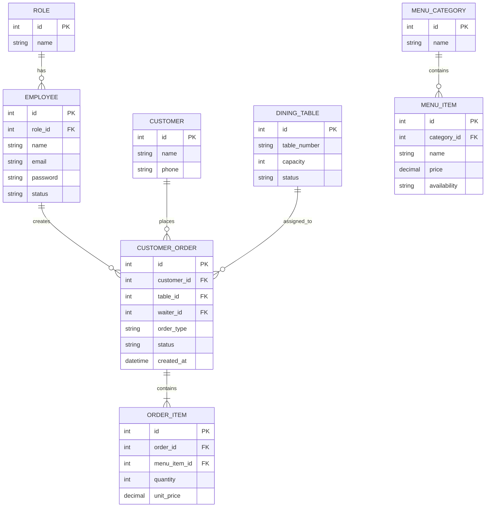

# Entity Relationship Diagram (ERD)

## Overview

This document describes the database design for the Restaurant Management System.

The ERD models the core entities, their attributes, and relationships. It is derived from the Domain Model and Business Rules.

## ERD Diagram

## Notes

### Primary Keys

- Every entity has a unique primary key (`id`).

### Foreign Keys

- `role_id` references `ROLE`.
- `category_id` references `MENU_CATEGORY`.
- `order_id` references `CUSTOMER_ORDER`.
- `menu_item_id` references `MENU_ITEM`.

### Business Constraints

- A dine-in order requires a table.
- A takeaway order does not require a table.
- An order must contain at least one order item.
- A menu item belongs to one category.